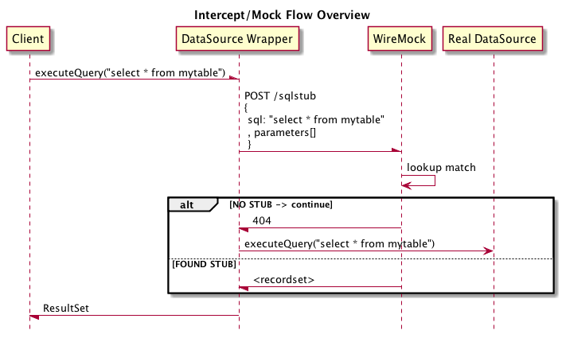

:toc: macro

# JDBC Service Virtualisation image:https://travis-ci.org/eeichinger/jdbc-service-virtualisation.svg?branch=master["Build Status", link="https://travis-ci.org/eeichinger/jdbc-service-virtualisation"]

toc::[]

## Overview

Demonstrates you to use the technique to just spy on a real database and intercept/mock only selected jdbc queries.

Under the hood it uses https://github.com/p6spy/p6spy[P6Spy] and http://mockrunner.sourceforge.net/examplesjdbc.html[MockRunner-JDBC] to spy on the JDBC connection and hooks into http://docs.oracle.com/javase/8/docs/api/java/sql/PreparedStatement.html#executeQuery--[PreparedStatement#executeQuery()]
and http://docs.oracle.com/javase/8/docs/api/java/sql/PreparedStatement.html#executeUpdate--[PreparedStatement#executeUpdate()] to redirect the call to an HTTP Server, e.g. http://wiremock.org/[WireMock] or similar HTTP Mock Servers. The major advantage of this approach is that we can reuse existing technologies to remotely stub a JDBC endpoint!

The following example using Spring's JdbcTemplate to avoid boilerplate JDBC

[source,java]
----
public class UseWireMockToMockJdbcResultSetsTest {

    @Rule
    public WireMockRule wireMockRule = new WireMockRule(0);

    JdbcTemplate jdbcTemplate;

    @Before
    public void before() {
        JdbcServiceVirtualizationFactory myJdbcMockFactory = new JdbcServiceVirtualizationFactory();
        myJdbcMockFactory.setTargetUrl("http://localhost:" + wireMockRule.port() + "/sqlstub");

        DataSource dataSource = myJdbcMockFactory.createMockDataSource();

        jdbcTemplate = new JdbcTemplate(dataSource);
    }

    @Test
    public void intercepts_matching_query_and_responds_with_mockresultset() {
        final String NAME = "Erich Eichinger";

        // setup mock resultsets
        WireMock.stubFor(WireMock
                .post(WireMock.urlPathEqualTo("/sqlstub"))
                    // SQL Statement is posted in the body, use any available matchers to match
                .withRequestBody(WireMock.equalTo("SELECT birthday FROM PEOPLE WHERE name = ?"))
                    // Parameters are sent with index has headername and value as headervalue
                .withHeader("1", WireMock.equalTo(NAME))
                    // return a recordset
                .willReturn(WireMock
                        .aResponse()
                        .withBody(""
                                + "<resultset>"
                                + "     <cols><col>birthday</col></cols>"
                                + "     <row><val>1980-01-01</val></row>"
                                + "</resultset>"
                        )
                )
        )
        ;

        String bday = jdbcTemplate
            .queryForObject(
                "SELECT birthday FROM PEOPLE WHERE name = ?"
                , String.class
                , NAME
            );

        assertThat(bday, equalTo("1980-01-01"));
    }
}
----

## Modes

There are 2 modes, Spy Mode and Mock Mode

### Spy Mode

In Spy Mode, the service virtualizer spies on a real datasource. In this case, only configured statements will be handled by WireMock, all other statements are routed through to the actual database.

Spy Mode is configured by wrapping the original DataSource using spyOnDataSource():

[source,java]
----
@Before
public void before() {
    // wiremock is listening on port WireMockRule#port(), point our Jdbc-Spy to it
    JdbcServiceVirtualizationFactory myP6MockFactory = new JdbcServiceVirtualizationFactory();
    myP6MockFactory.setTargetUrl("http://localhost:" + wireMockRule.port() + "/sqlstub");

    // wrap the real datasource so we can spy/intercept it
    DataSource dataSource = ... // grab real DataSource
    wrappedDataSource = myP6MockFactory.spyOnDataSource( dataSource );

    // use wrapped dataSource
}
----

### Mock Mode

In Mock Mode you don't need a real database. Any statement must be configured in WireMock. If WireMock returns 404 (i.e. no match was found), an {@link AssertionError} is thrown.

[source,java]
----
@Before
public void before() {
    // wiremock is listening on port WireMockRule#port(), point our Jdbc-Spy to it
    JdbcServiceVirtualizationFactory myP6MockFactory = new JdbcServiceVirtualizationFactory();
    myP6MockFactory.setTargetUrl("http://localhost:" + wireMockRule.port() + "/sqlstub");

    DataSource dataSource = myP6MockFactory.createMockDataSource();

    // use dataSource as usual
}
----

## Example "Spy Mode":

include::src/test/java/example/UseWireMockToInterceptJdbcResultSetsTest.java[]

## Example "Mock Mode":

include::src/test/java/example/UseWireMockToMockJdbcResultSetsTest.java[]

Nightly builds are provided by https://nightli.es/
