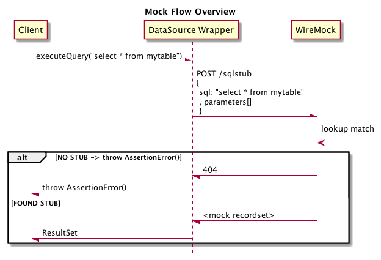

:toc: macro

# JDBC Service Virtualisation image:https://travis-ci.org/eeichinger/jdbc-service-virtualisation.svg?branch=master["Build Status", link="https://travis-ci.org/eeichinger/jdbc-service-virtualisation"]

toc::[]

## What does it do?

This library provides JDBC DataSource wrapper (similar to https://github.com/p6spy/p6spy[P6Spy]) in order to spy on or mock database operations. It redirects JDBC operations to an HTTP server, so you can use http://wiremock.org/[WireMock] or similar HTTP Mock Servers to define the actual Mock behaviour. The major advantage of this approach is that we can reuse existing technologies to remotely stub a JDBC endpoint.

Under the hood it uses https://github.com/p6spy/p6spy[P6Spy] and http://mockrunner.sourceforge.net/examplesjdbc.html[MockRunner-JDBC] to spy on the JDBC connection and hooks into http://docs.oracle.com/javase/8/docs/api/java/sql/PreparedStatement.html#executeQuery--[PreparedStatement#executeQuery()]
and http://docs.oracle.com/javase/8/docs/api/java/sql/PreparedStatement.html#executeUpdate--[PreparedStatement#executeUpdate()] to redirect the call to an HTTP Server as shown below:

image:doc/flow-spy.png[]

The following example using Spring's JdbcTemplate to avoid boilerplate JDBC and demonstrates how to use the technique to just spy on a real database and intercept/mock only selected jdbc queries.

[source,java]
----
public class UseWireMockToMockJdbcResultSetsTest {

    @Rule
    public WireMockRule wireMockRule = new WireMockRule(0);

    JdbcTemplate jdbcTemplate;

    @Before
    public void before() {
        JdbcServiceVirtualizationFactory myJdbcMockFactory = new JdbcServiceVirtualizationFactory();
        myJdbcMockFactory.setTargetUrl("http://localhost:" + wireMockRule.port() + "/sqlstub");

        DataSource dataSource = myJdbcMockFactory.createMockDataSource();

        jdbcTemplate = new JdbcTemplate(dataSource);
    }

    @Test
    public void intercepts_matching_query_and_responds_with_multi_column_mockresultset() {
        final String NAME_ERICH_EICHINGER = "Erich Eichinger";
        final String PLACE_OF_BIRTH = "Vienna";

        // setup mock resultsets
        WireMock.stubFor(WireMock
                .post(WireMock.urlPathEqualTo("/sqlstub"))
                // SQL Statement is posted in the body, use any available matchers to match
                .withRequestBody(WireMock.equalTo("SELECT birthday, placeofbirth FROM PEOPLE WHERE name = ?"))
                // Parameters are sent with index has headername and value as headervalue
                .withHeader("1", WireMock.equalTo(NAME_ERICH_EICHINGER))
                // return a recordset
                .willReturn(WireMock
                        .aResponse()
                        .withBody(""
                                + "<resultset>"
                                + "     <cols><col>birthday</col><col>placeofbirth</col></cols>"
                                + "     <row>"
                                + "         <birthday>1980-01-01</birthday>"
                                + "         <placeofbirth>" + PLACE_OF_BIRTH + "</placeofbirth>"
                                + "     </row>"
                                + "</resultset>"
                        )
                )
        )
        ;

        String[] result = jdbcTemplate.queryForObject(
                "SELECT birthday, placeofbirth FROM PEOPLE WHERE name = ?"
                , new Object[] { NAME_ERICH_EICHINGER }
                , (rs, rowNum) -> {
                    return new String[] { rs.getString(1), rs.getString(2) };
                }
        );

        assertThat(result[0], equalTo("1980-01-01"));
        assertThat(result[1], equalTo(PLACE_OF_BIRTH));
    }
}
----

## Operation Modes

JdbcServiceVirtualizationFactory supports two modes, *Spy Mode* and *Mock Mode*

### Spy Mode

In Spy Mode, the service virtualizer spies on a real datasource. In this case, only configured statements will be handled by WireMock, all other statements are routed through to the actual database.

Spy Mode is configured by wrapping the original DataSource using spyOnDataSource():

image:doc/flow-spy.png[]

[source,java]
----
@Before
public void before() {
    // wiremock is listening on port WireMockRule#port(), point our Jdbc-Spy to it
    JdbcServiceVirtualizationFactory myP6MockFactory = new JdbcServiceVirtualizationFactory();
    myP6MockFactory.setTargetUrl("http://localhost:" + wireMockRule.port() + "/sqlstub");

    // wrap the real datasource so we can spy/intercept it
    DataSource dataSource = ... // grab real DataSource
    wrappedDataSource = myP6MockFactory.spyOnDataSource( dataSource );

    // use wrapped dataSource
}
----

*Full Example*

see link:src/test/java/example/UseWireMockToInterceptJdbcResultSetsTest.java[]

### Mock Mode

In Mock Mode you don't need a real database. Any statement must be configured in WireMock. If WireMock returns 404 (i.e. no match was found), an {@link AssertionError} is thrown.

Mock Mode is configured by creating the datasource using createMockDataSource():

[source,java]
----
@Before
public void before() {
    // wiremock is listening on port WireMockRule#port(), point our Jdbc-Spy to it
    JdbcServiceVirtualizationFactory myP6MockFactory = new JdbcServiceVirtualizationFactory();
    myP6MockFactory.setTargetUrl("http://localhost:" + wireMockRule.port() + "/sqlstub");

    DataSource dataSource = myP6MockFactory.createMockDataSource();

    // use dataSource as usual
}
----

*Full Example*

see link:src/test/java/example/UseWireMockToMockJdbcResultSetsTest.java[]

## Getting the Binaries

the library is available from Maven Central via

[source,xml]
----
<dependency>
    <groupId>com.github.eeichinger.service-virtualisation</groupId>
    <artifactId>jdbc-service-virtualisation</artifactId>
    <version>0.0.2.RELEASE</version>
</dependency>
----

or download from http://search.maven.org/#search%7Cga%7C1%7Cjdbc-service-virtualisation

## Contributing

For bugs, feature requests or questions and discussions please use GitHub issues on https://github.com/eeichinger/jdbc-service-virtualisation/issues.

### Building

To build the project simply run

    mvn clean install

### CI

Travis is used to build and release this project https://travis-ci.org/eeichinger/jdbc-service-virtualisation

### Nightly Builds

nightly builds are triggered via https://nightli.es/

### Build Reports

reports (Javadoc etc.) are published on https://eeichinger.github.com/jdbc-service-virtualisation
